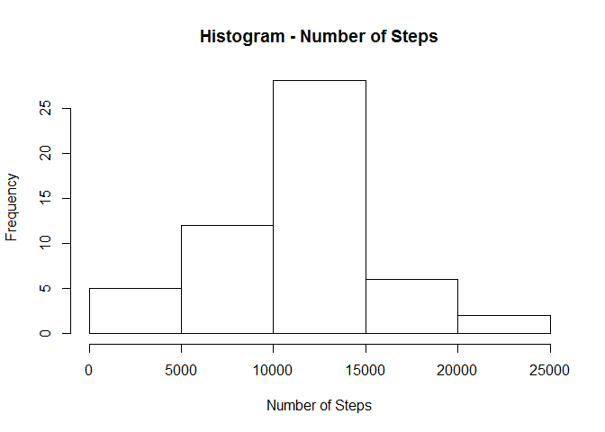
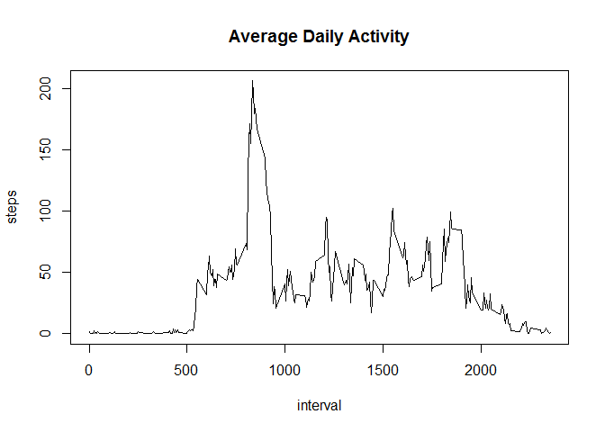
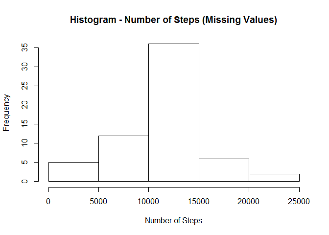
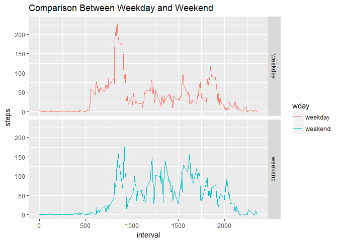

# Reproducible Research: Peer Assessment 1

## Setting environment variables


```r
setwd("C:/WorkSpace/DS/C5W2")
zip_file = "./activity.zip"
data_file = "./activity.csv"

library(ggplot2)
library(lubridate)
```

## Loading and preprocessing the data


```r
if (!file.exists(data_file)) {
#    download.file(url, destfile = download_file)
    unzip(zip_file)
}

df <- read.csv(data_file)
df$date <- as.Date(df$date)
```

## Histogram of the total number of steps taken each day


```r
daily_total <- aggregate(steps ~ date, data = df, FUN = sum)
hist(daily_total$steps, main="Histogram - Number of Steps", xlab = "Number of Steps")
```

<!-- -->

## Mean and median number of steps taken each day


```r
mean(daily_total$steps)
```

```
## [1] 10766.19
```

```r
median(daily_total$steps)
```

```
## [1] 10765
```

## Average daily activity pattern

Here is a time series plot of the average number of steps taken.

```r
interval_avg <- aggregate(steps ~ interval, data = df, FUN = mean, na.rm = TRUE)
plot(steps ~ interval, data = interval_avg, type = "l", main = "Average Daily Activity")
```

<!-- -->

The 5-minute interval that, on average, contains the maximum number of steps. It is the interval 835.

```r
interval_avg[which.max(interval_avg$steps),]$interval
```

```
## [1] 835
```

## Imputing missing values

Here is the number of missing values in the dataset.

```r
sum(is.na(df$steps))
```

```
## [1] 2304
```
Use mean for the 5-minute interval to fill the missing values.

```r
# make a backup before imputing
df1 <- df
df$steps[is.na(df$steps)] <- mean(df$steps, na.rm = T)
```
Histogram of the total number of steps taken each day after filling the missing values.You can see that the histogram doesn't change much in general, but is a bit higher near the peak point.

```r
daily_total <- aggregate(steps ~ date, data = df, FUN = sum)
hist(daily_total$steps, main="Histogram - Number of Steps (Missing Values)", xlab = "Number of Steps")
```

<!-- -->

Mean and median number of steps taken each day after filling the missing values.

```r
mean(daily_total$steps)
```

```
## [1] 10766.19
```

```r
median(daily_total$steps)
```

```
## [1] 10766.19
```

## Comparing the average number of steps taken per 5-minute interval across weekdays and weekends
Here is a plot with two panel showing average number of steps per weekday and weekend, respectively.

```r
#restore data from backup
df <- df1
df$wday1 <- wday(df$date)
df$wday <- ifelse(df$wday1 %in% c(1,7), "weekend", "weekday")
df <- df[, -which(names(df) %in% c("wday1"))]
wday_interval_avg <- aggregate(steps ~ interval + wday, data = df, FUN = mean, na.rm = TRUE)
df1 <- aggregate(steps ~ interval + wday, data = df, FUN = mean, na.rm = T)
ggplot(data = df1, aes(x = interval, y = steps, color = wday)) + facet_grid(wday ~ .) + geom_line(stat = "identity") + 
labs(title = "Comparison Between Weekday and Weekend")
```

<!-- -->

## Clean the data file


```r
# remove the data file
file.remove(data_file)
```

```
## [1] TRUE
```
